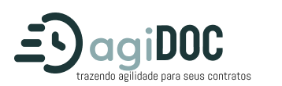
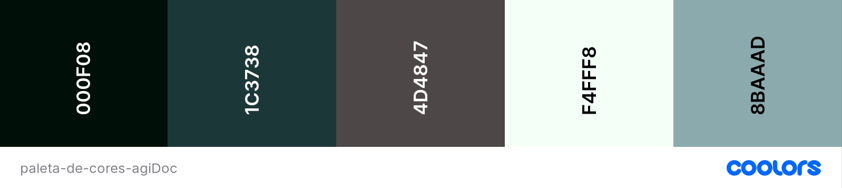

## Atividade: Soluções Inovadoras

Bem-vindo ao repositório do agiDoc, um projeto inovador destinado a revolucionar a gestão de contratos na administração pública.
Enfrentando os desafios críticos de morosidade, burocracia e falta de transparência, o agiDoc surge como uma solução abrangente para
otimizar o ciclo de vida dos contratos.

## Índice
* [1- Objetivo da tarefa](#objetivo-da-tarefa)
* [2- Escolha: ODS - Desafio de Desenvolvimento Sustentável da ONU](#escolha-ods-desafio-de-desenvolvimento-sustentável-da-onu)
* [3- Metodologia](#metodologia)
* [4- Instruções para acessar o projeto](#instruções-para-acessar-o-projeto)
* [5- Lista de Integrantes](#lista-de-integrantes)

***

## 1. Objetivo da Tarefa 

Promover a conscientização e inovação entre os participantes, incentivando-os a desenvolver soluções tecnológicas que enfrentem 
desafios específicos relacionados aos Objetivos de Desenvolvimento Sustentável (ODS) da ONU. 

***

## 2. Escolha: ODS - Desafio de Desenvolvimento Sustentável da ONU

Para esta atividade a *ODS* pincipal escolhida foi a: 

- 16 Paz, Justiça e Instutuições Eficazes
Foco em promover, através do fortalecimento do Estado de Direito, uma sociedade mais igualitária, pacífica, eficiente, transparente,
com acesso público à informação - de qualidade -, bem como aprimorar a representação da população, ampliando o exercício de cidadania
e participação popular através das instituições governamentais.

E indiretamente estará ligada à outras 2 *ODS*:
- 12 Consumo e Produção Responsáveis;
- 17 Parcerias e Meios de Implementação;

  ***

## Metodologia

Tarefa realizada em grupo com integrantres das três *staks* do projeto de estágio *Vem Ser* da empresa *DBC - Company*
Para o desenvolvimento da tarefa nos organizamos das seguintes maneiras:

- Em um primeiro momento utilizamos o site *Miro* para realizar o *brainstorm* e encontrar a nossa solução inovadora.
- Realizamos reuniões diárias com o intuito de discutir sobre o tema, além de desenvolver o relatório e acertar todos os detalhes envolvidos;
- Para a organização das atividades de cada integrante, utilizamos a ferramenta *Trello*;
- Realizamos votações para decidir a paleta de cores e o logotipo;

Após discutirmos a funcionalidade de nossa aplicação decidimos pelo *logo* e paleta de cor a seguir por trazerem a sensação de profissionalismo, sofisticação e sustentabilidade.
Ainda mais sobre o *logo*, damos enfasê a documentos através do destaque das letras **DOC** e como desenho do relógio vinculamos o pensamento assertivo da agilidade nos processos.

***

## 4. Instruções para acessar o projeto

Para obter maiores informações sobre o projeto é necessário clicar no documento em extensão *.pdf* de nome agiDoc que se encontra na pasta raíz deste repositório.

***

## 5. Lista de Integrantes

* Trilha Backend:

- [Ícaro Leon](https://github.com/icaroleon/)
- [Mariana Reis](https://github.com/MariSIN)
- [Rodirigo Carvalho](https://github.com/RodrigoFCC)
- [Vinicius Pires](https://github.com/ViniciusPiresB)

* Trilha Frontend:

- [Camila Gonçalves](https://github.com/CamilaVerso)
- [Clara Maestri](https://github.com/vivalaclara)

* Trilha QA:

- [Aron Adams](https://github.com/AronAdamsRapetto)
- [Gabriel Sales](https://github.com/gabrielsalesdev)

  

